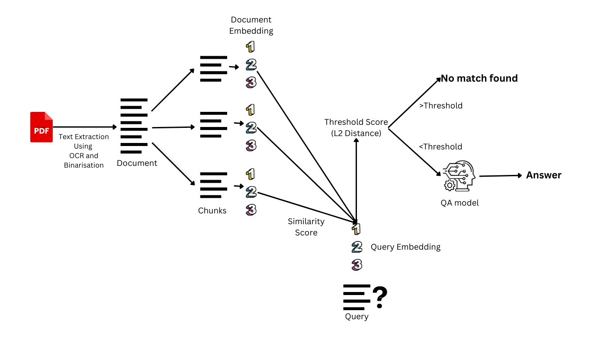

# Smart Querying for PDFs

## Introduction

This application provides a interface for querying a pdf file smartly .It performs detailed text extraction from pdf using tessaract and preprocessing, including text cleaning and segmentation into manageable chunks. These chunks are embedded using the sentence-transformers/all-mpnet-base-v2 model and stored in a FAISS vector database for efficient similarity searches. Users can input queries related to the PDF content, with responses generated by the t5-large model, which synthesizes information from relevant text chunks to deliver precise answers. 

## Project Flow


### 1. Extracting the text from pdf files

1.	Convert PDF Pages to Images:
First, we take the PDF file and convert each of its pages into images. This is done because PDFs are composed of scanned images that we need to interpret as text for further processing. This step involves reading the entire PDF file and generating an image for each page to extract text.
2.	Prepare Images for Text Extraction:
Once we have the images of the PDF pages, the next step is to preprocess these images to make it easier for OCR to accurately recognize the text. 
We apply a technique called binarization. This technique transforms the image into a binary image where the text appears in high contrast against the background. This makes the text more distinct and easier for OCR to detect. 

$$
T(x, y) = 
\begin{cases} 
255 & \text{if } I(x, y) \geq T \\
0 & \text{if } I(x, y) < T
\end{cases}
$$

4.	Perform Optical Character Recognition (OCR):
With the preprocessed images ready, we use OCR technology to read and extract the text from each image. OCR works by analyzing the patterns in the image and converting them into readable text. The OCR engine examines the binary image and identifies characters and words.
5.	Combine Text from All Pages:
After extracting text from each image, we compile the text from all pages into a single cohesive text. This means that if the PDF has multiple pages, the text extracted from each page is collected and combined into one large text block, maintaining the content and flow of the original document.

### Processing the text 
1. First, we need to handle the text by dividing it into smaller, more manageable pieces. This helps in processing the text efficiently because working with huge blocks of text can be cumbersome. We split the text into chunks, making sure each piece is not too large—about 500 characters is a good size. We also make sure that there’s a bit of overlap between consecutive chunks, about 200 characters, to ensure that no important context is lost between chunks.
2. Once the text is divided into chunks, we convert these chunks into numerical representations known as embeddings. This process is like translating the text into a language that a computer can understand. Each chunk is turned into a vector, which is essentially a list of numbers that capture the meaning of the text. This translation is done using a pre-trained model that understands the semantics of the text. We use a pre-trained model from the HuggingFaceEmbeddings library. This model (sentence-transformers/all-mpnet-base-v2) converts each text chunk into a vector in a high-dimensional space, where similar meanings are represented by similar vectors.
3. After we have these numerical representations, we need to store them in a way that allows us to quickly retrieve and compare them. We use a specialized library called FAISS for this. FAISS is great for handling and searching through large amounts of these numerical vectors efficiently.
4. Finally, we keep track of all this processed information by storing it in the session state of our application. This way, when users ask questions or perform searches, we can quickly use the preprocessed data to find the most relevant information without having to go through the whole process again.


## Setup

Ensure you have latest version of python installed (python=3.9.19).

1. Install all the required libraries.
```
pip install -r requirements.txt
```

2. Download all the required models.
```
python3 download_models.py
```

3. Run the streamlit app.
```
streamlit run app.py
```
4. Upload the pdf file and ask your question.


   
## Resources 
```google-t5/t5-large``` - <a href="https://huggingface.co/google-t5/t5-large">Hugging Face<a/> <br>
```sentence-transformers/all-mpnet-base-v2``` - <a href="https://huggingface.co/sentence-transformers/all-mpnet-base-v2">Hugging Face<a/>
